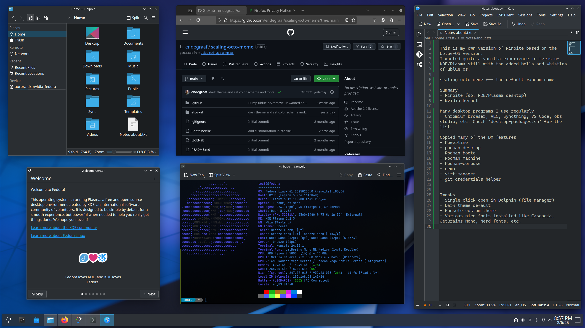

# scaling octo meme
This is my own version of Kinoite based on the Ublue-OS version.
I wanted quite a vanilla experience in terms of KDE/Plasma still with the added bells and whistles of ublue-os.

Name of this repo (scaling octo meme) is the default random name by the ublue-os template script. Check [here](https://github.com/ublue-os/image-template) for the template repo. 

Summary:
- Fedora Atomic Kinoite (so, KDE/Plasma desktop)
- Nvidia kernel
*You can change this to some other base image if you want in de `Containerfile`*

Many desktop programs I use regularly
- Chromium browser, VLC, Syncthing, VS Code, obs studio, etc. Check `desktop-packages.sh` for the list.

Copied many of the DX features
- Powerline
- Podman desktop
- Podman-bootc
- Podman-machine
- Podman-compose
- qemu
- virt-manager
- git credentials helper
- etc ...

Tweaks
- Single click open in Dolphin (file manager)
- Dark theme default
- Konsole custom theme (edg1)
- Various nice fonts installed like Cascadia, JetBrains Mono, Nerd fonts, etc.
*You could change the provisioned config in `etc/skel` directory (hidden files)*

